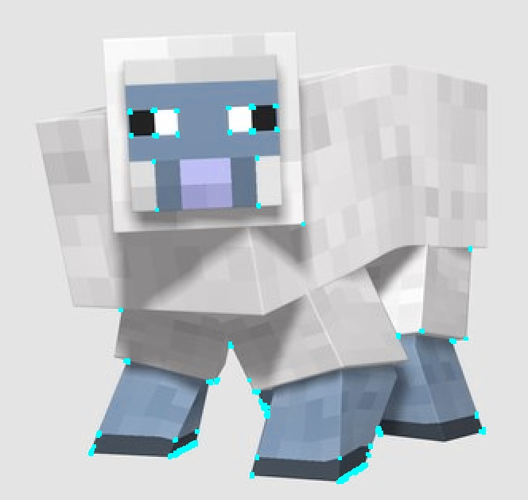

  <h1>
    🤖 Visão Computacional
  </h1>

  > 17º aula da disciplina de visão computacional: Algoritmo de Viola-Jones com Haar Cascades. Disciplina do Mestrado em Computação Aplicada (PPCA) Tucuruí/Pará. Instruída pela Prof. Dr. Fabrício de Souza Farias

  ---
  
   

## :rocket: Conteúdo Trabalhado

- [Viola-Jones]()
- [Edge Features]()
- [Line Features]()
- [Four-rectangle Features]()
- [Reconhecimento Facial em vídeo e imagem]()
---

## :rocket: Tecnologias Utilizadas
---
- [numpy]()
- [matplotlib]()
- [opencv]()
## :man_student: Autor
---

Feito com ♥ by Laciene Melo:wave: [#lacymelo](https://github.com/lacymelo)
